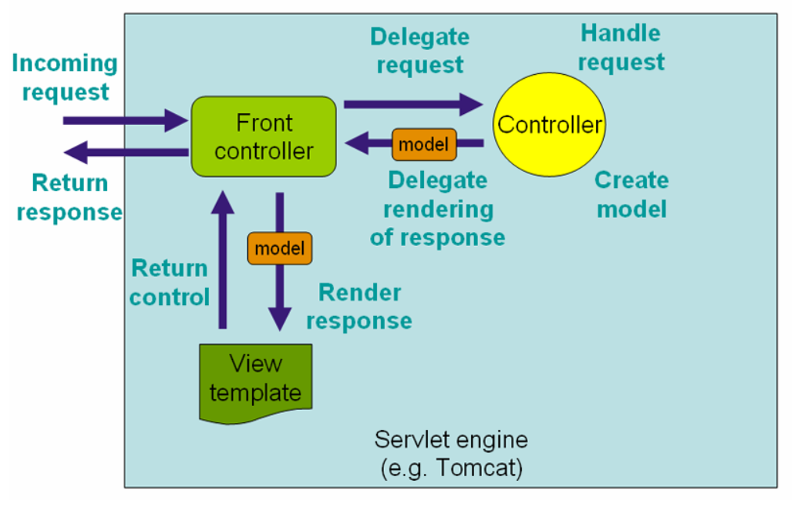

# 初识Spring Boot，开发社区首页

## 1. 搭建开发环境

### Apache Maven

* 可以帮助我们构建项目、管理项目中的jar包
* Maven仓库：存放构件的位置
  * 构件:创建项目时依赖的资源jar包.
  * 本地仓库：默认是 ~/.m2/repository
  * 远程仓库：中央仓库(官网)、镜像仓库(第三方网站)、私服仓库(公司自己搭建)
*  示例：安装、配置、常用命令
  * 下载 : http://maven.apache.org
  * 解压,配置conf文件夹下,settings.xml.修改为阿里云镜像仓库.<mirror>标签下修改网址.
  * 将bin文件路径配置到环境变量
  * 常用命令: 创建,编译(生成target文件夹),清除,测试.

### IntelliJ IDEA

* 目前最流行的Java集成开发工具
*  示例：安装、配置、创建项目
  * 下载: http://www.jetbrains.com/idea
  * Eclipse创建的项目需要导入(import),IDEA的直接open就可以.
  * Settings的Editor下设置maven及其配置文件.
  * 创建maven模板项目.
  * 重新编译 Ctrl+F9

### Spring Initializr

* 把包进行整合按功能划分归类.

* 创建 Spring Boot 项目的引导工具
  * https://start.spring.io
*  示例：创建“牛客社区”项目
  * springboot内嵌了Tomcat.

### Spring Boot 入门示例
*  Spring Boot 核心作用
  
* 起步依赖、自动配置、端点监控
  
* 示例:一个简单的处理客户端请求案例

  * application.properties文件进行配置

    ``````
    # ServerProperties
    server.port=8080         服务器端口
    server.servlet.context-path=/community  项目访问路径
    ``````

## 2. Spring入门

### Spring全家桶
* Spring Framework 
* Spring Boot
* Spring Cloud (微服务,大项目拆分成若干子项目)
* Spring Cloud Data Flow(数据集成)
*  官网: https://spring.io

### Spring Framework
* Spring Core

* IoC、AOP  (管理对象的思想,spring管理的对象叫做Bean.)

* Spring Data Access
  * Transactions(事务)、Spring MyBatis
* Web Servlet
  * Spring MVC
* Integration(集成)
  * Email、Scheduling(定时任务)、AMQP(消息队列)、Security(安全控制)

### Spring IoC
* Inversion of Control
  * 控制反转，是一种面向对象编程的设计思想。
*  Dependency Injection
  * 依赖注入，是IoC思想的实现方式。
*  IoC Container
  * IoC容器，是实现依赖注入的关键，本质上是一个工厂。
  * 容器管理Bean的前提:提供Bean的类型,通过配置文件配置Bean之间的关系.
  * 降低Bean之间的耦合度

### 代码部分

* 主动获取:

``````
@SpringBootApplication
public class CommunityApplication {
	public static void main(String[] args) {
		SpringApplication.run(CommunityApplication.class, args);
	}
}
配置类,启动时自动扫描,扫描配置类所在的包以及子包下的Bean.
@Component @Repository @Service @Controller
``````

测试代码要以其为配置类,需加上注解:

``````
@ContextConfiguration(classes = CommunityApplication.class)
``````

想要使用spring容器需要实现接口,ApplicationContextAware,实现接口中set方法.传入参数applicationContext(spring容器),他是一个接口,继承自BeanFactory.

获取Bean:applicationContext.getBean(test.class);

``````
public class CommunityApplicationTests implements ApplicationContextAware {

	private ApplicationContext applicationContext;

	@Override
	public void setApplicationContext(ApplicationContext applicationContext) throws BeansException {
		this.applicationContext = applicationContext;
	}
}
``````

给Bean自定义名字:@Component("名字")

初始化方法@PostConstruct,在构造器之后调用.销毁对象之前调用,@PreDestroy.

@Scope()指定单例多例

@Configuration配置类,用以装载使用第三方类.

* 自动注入:
  * @Autowired

## 3. Spring MVC入门

### HTTP
* HyperText Transfer Protocol
* 用于传输HTML等内容的应用层协议
* 规定了浏览器和服务器之间如何通信，以及通信时的数据格式。
* 学习网站：https://developer.mozilla.org/zh-CN

浏览器服务器通信步骤：

1. 打开一个TCP连接
2. 发生一个HTTP报文 
3. 读取服务器返回的报文信息
4. 关闭连接或为后续请求重用连接

- 按下F12进入调试，在Network下看请求响应（Header和Response）

### Spring MVC

* 三层架构
  * 表现层(mvc)、业务层、数据访问层

*  MVC(设计模式)
  * Model：模型层
  * View：视图层
  * Controller：控制层

* 核心组件
  * 前端控制器：DispatcherServlet

浏览器访问服务器，首先访问的时Controller控制层，Controller调用业务层处理，处理完后将得到的数据封装到Model,传给视图层。

 

### Thymeleaf
* 模板引擎
  * 生成动态的HTML。
*  Thymeleaf
  * 倡导自然模板，即以HTML文件为模板。
* 常用语法
  * 标准表达式、判断与循环、模板的布局。

### 代码部分

底层：

```java
@RequestMapping("/http")
public void http(HttpServletRequest request, HttpServletResponse response) {
    // 获取请求数据
    System.out.println(request.getMethod());
    System.out.println(request.getServletPath());
    Enumeration<String> enumeration = request.getHeaderNames();
    while (enumeration.hasMoreElements()) {
        String name = enumeration.nextElement();
        String value = request.getHeader(name);
        System.out.println(name + ": " + value);
    }
    System.out.println(request.getParameter("code"));

    // 返回响应数据
    response.setContentType("text/html;charset=utf-8");
    try (
        PrintWriter writer = response.getWriter();
    ) {
        writer.write("<h1>xx网</h1>");
    } catch (IOException e) {
        e.printStackTrace();
    }
}
```

从路径中得到变量GET（两种方法）：

```java
@RequestMapping(path = "/students", method = RequestMethod.GET)
@ResponseBody
public String getStudents(
    @RequestParam(name = "current", required = false, defaultValue = "1") int current,
    @RequestParam(name = "limit", required = false, defaultValue = "10") int limit) {
    System.out.println(current);
    System.out.println(limit);
    return "some students";
}

@RequestMapping(path = "/student/{id}", method = RequestMethod.GET)
@ResponseBody
public String getStudent(@PathVariable("id") int id) {
    System.out.println(id);
    return "a student";
}
```

POST请求:

``````java
@RequestMapping(path = "/student", method = RequestMethod.POST)
@ResponseBody
public String saveStudent(String name, int age) {
    System.out.println(name);
    System.out.println(age);
    return "success";
}
``````

响应HTML数据(使用ModelAndView或Model):

``````java
@RequestMapping(path = "/teacher", method = RequestMethod.GET)
public ModelAndView getTeacher() {
    ModelAndView mav = new ModelAndView();
    mav.addObject("name", "张三");
    mav.addObject("age", 30);
    mav.setViewName("/demo/view");
    return mav;
}

@RequestMapping(path = "/school", method = RequestMethod.GET)
public String getSchool(Model model) {
    model.addAttribute("name", "北京大学");
    model.addAttribute("age", 80);
    return "/demo/view";
}
``````

 响应JSON数据(异步请求)：Java对象 -> JSON字符串 -> JS对象,使用@ResponseBody注解

``````java
@RequestMapping(path = "/emp", method = RequestMethod.GET)
@ResponseBody
public Map<String, Object> getEmp() {
    Map<String, Object> emp = new HashMap<>();
    emp.put("name", "张三");
    emp.put("age", 23);
    return emp;
}
//转换为json字符串  {"name":"张三","age":"23"}
//也可以返回List<Map<String, Object>>，list集合。
``````

## 5. MyBatis入门

### 安装数据库

* 安装MySQL Server
*  安装MySQL Workbench

### MyBatis
* 核心组件
  * SqlSessionFactory：用于创建SqlSession的工厂类。
  * SqlSession：MyBatis的核心组件，用于向数据库执行SQL。
  * 主配置文件：XML配置文件，可以对MyBatis的底层行为做出详细的配置。
  * Mapper接口：就是DAO接口，在MyBatis中习惯性的称之为Mapper。
  * Mapper映射器：用于编写SQL，并将SQL和实体类映射的组件，采用XML、注解均可实现。

* 示例
  * 使用MyBatis对用户表进行CRUD操作。

* 在application.properties中配置数据库、Mybatis相关。

## 6. 开发社区首页
* 开发流程
  * 1次请求的执行过程
*  分步实现
  * 开发社区首页，显示前10个帖子
  * 开发分页组件，分页显示所有的帖子


## 7. 项目调试技巧
* 响应状态码的含义
* 服务端断点调试技巧
* 客户端断点调试技巧
* 设置日志级别，并将日志输出到不同的终端

## 8. 版本控制
* 认识Git
  * Git简介
  * Git的安装与配置
* Git常用命令
  * 将代码提交至本地仓库
  * 将代码上传至远程仓库
* IDEA集成Git
  * 在IDEA中配置并使用Git

```c
# 账号配置
git config --list
git config --global user.name "mywang"
git config --global user.email "1311025321@qq.com"
# 本地仓库
git init
git status -s
git add *
git commit -m '...'
# 生成秘钥
ssh-keygen -t rsa -C "1311025321@qq.com"
# 推送已有项目
git remote add origin
https://git.nowcoder.com/334190970/Test.git
git push -u origin master
# 克隆已有仓库
git clone https://git.nowcoder.com/334190970/Test.git
```


